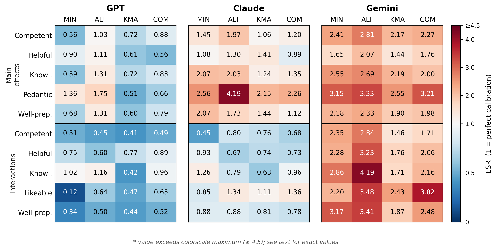
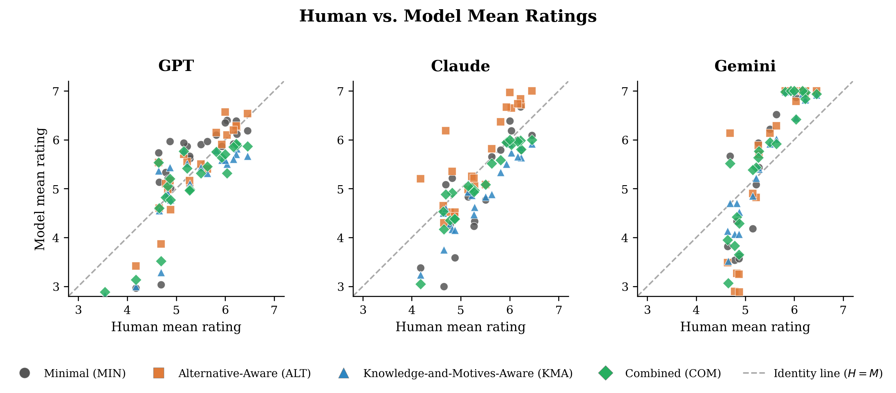
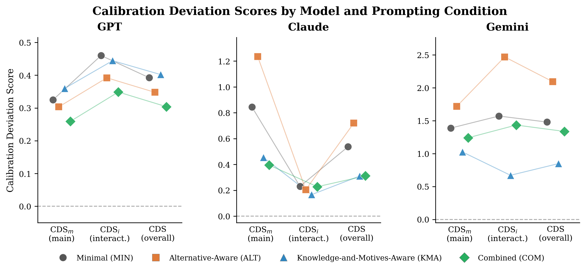

# LLM Social Calibration

Code and data for the paper:

> **Social Meaning in Large Language Models: Structure, Magnitude, and Pragmatic Prompting**
> Accepted at CMCL 2026 (Workshop on Cognitive Modeling and Computational Linguistics, co-located with LREC 2026)
> arXiv: https://arxiv.org/abs/2604.02512

---

## Notebook

**`notebooks/01_social_meaning_llms.ipynb`** — guided walkthrough of the full analysis: data loading, structural alignment, global pattern similarity, magnitude calibration (ESR/CDS), and result figures.

| | |
|---|---|
| [](https://colab.research.google.com/github/muehlenbernd/llm-social-calibration/blob/main/notebooks/01_social_meaning_llms.ipynb) | Interactive (Google account required) |
| [](https://mybinder.org/v2/gh/muehlenbernd/llm-social-calibration/main?filepath=notebooks/01_social_meaning_llms.ipynb) | Interactive (no account needed; slower start) |
| [](https://github.com/muehlenbernd/llm-social-calibration/blob/main/notebooks/01_social_meaning_llms.ipynb) | Read-only rendered view |

---

## Overview

Do LLMs approximate human social meaning not only qualitatively but also quantitatively?
And can prompting strategies informed by pragmatic theory improve this approximation?

This repository provides the evaluation framework and collected LLM ratings for a case study
on numerical (im)precision. We introduce two calibration-focused metrics — the **Effect Size
Ratio (ESR)** and the **Calibration Deviation Score (CDS)** — that distinguish structural
fidelity from magnitude calibration, and evaluate four pragmatically motivated prompting
conditions across three frontier LLMs.

**Key finding:** All models reliably reproduce the *direction* of human social inferences
(DAS = ISS = 1.0), but differ substantially in *magnitude* calibration. Combined prompting
(reasoning over alternatives + speaker knowledge/motives) is the only condition that improves
all calibration-sensitive metrics across all models simultaneously.

---

## Results


*Effect Size Ratios per model, prompting condition, and benchmark effect.
White = perfect calibration (ESR = 1); blue = attenuation; red = exaggeration.*


*Human vs. model mean ratings across all conditions. Points on the dashed
identity line indicate perfect magnitude calibration.*


*Calibration Deviation Scores by model and prompting condition.
Lower = better alignment with human effect magnitudes.*

---

## Repository Structure

```
llm-social-calibration/
│
├── notebooks/
│   └── 01_social_meaning_llms.ipynb  # Guided analysis walkthrough
│
├── src/
│   ├── collection/         # LLM querying: API calls, experiment runner
│   │   ├── main.py         # Entry point for data collection
│   │   └── models.py       # API wrappers (GPT, Claude, Gemini)
│   ├── analysis/
│   │   ├── main_metrics.py # Entry point: ESR, CDS, CCC, RMSE, Spearman (Tables 1–2, Fig. 1)
│   │   ├── main_correl.py  # Entry point: human–LLM concordance analysis
│   │   ├── metrics.py      # Metric implementations (ESR, CDS, DAS, ISS, CCC)
│   │   ├── metrics_plotter.py
│   │   ├── statistics_compare.py
│   │   └── correlation_analysis.py
│   ├── config.py           # Experiment parameters (models, scenarios, attributes)
│   ├── exp_texts.py        # Scenario texts (6 scenarios × 2 contexts × 2 utterance forms)
│   ├── parsing.py          # Likert response parser
│   └── io_utils.py         # JSON/CSV I/O helpers
│
├── prompts/
│   └── build_prompts.py    # Four prompting conditions: MIN, ALT, KMA, COM
│
├── data/
│   ├── llm_ratings/        # LLM ratings collected via API (4 conditions)
│   │   ├── results_MIN.json
│   │   ├── results_ALT.json
│   │   ├── results_KMA.json
│   │   └── results_COM.json
│   └── human_ratings/      # Human benchmark data (Solt et al. 2025)
│
├── results/figures/        # Generated plots (ESR heatmaps, scatter, CDS)
│
├── .env.example            # API key template
└── requirements.txt
```

---

## Prompting Conditions

| Label | Description |
|-------|-------------|
| **MIN** | Minimal — mirrors human experiment instructions verbatim |
| **ALT** | Alternative-Aware — one-shot chain-of-thought exemplar eliciting reasoning over utterance alternatives |
| **KMA** | Knowledge-and-Motives-Aware — explicit instruction to reason about speaker knowledge states and communicative motives |
| **COM** | Combined — integrates ALT and KMA extensions |

---

## Models Evaluated

| Model | API identifier |
|-------|---------------|
| GPT | `gpt-4o-mini` |
| Claude | `claude-sonnet-4-20250514` |
| Gemini | `gemini-2.5-pro` |

---

## Data

**LLM ratings** are included in `data/llm_ratings/` (4 JSON files, one per prompting condition).

**Human benchmark data** (Solt et al. 2025) is archived at:
> OSF: https://doi.org/10.17605/OSF.IO/M4RHN

Place `impX1.csv` in `data/human_ratings/` before running the analysis scripts or notebook.

---

## Setup

```bash
git clone https://github.com/muehlenbernd/llm-social-calibration.git
cd llm-social-calibration
pip install -r requirements.txt
cp .env.example .env   # add your API keys (only needed for data collection)
```

---

## Reproducing the Analysis

The LLM ratings are already included. To reproduce Tables 1–2 and Figure 1, place the human
benchmark data (see above) and either open the notebook or run:

```bash
python -m src.analysis.main_metrics
```

To re-collect LLM ratings from scratch (requires API keys):

```bash
# Set PROMPT_TYPE in src/collection/main.py, then:
python -m src.collection.main
```

---

## Metrics

**ESR (Effect Size Ratio):** ratio of model to human effect magnitude for each significant
benchmark effect. ESR = 1 indicates perfect calibration; ESR > 1 exaggeration; ESR < 1 attenuation.

**CDS (Calibration Deviation Score):** mean absolute deviation of ESR from 1 across all
significant effects. Lower = better magnitude alignment.

These complement standard structural metrics (Spearman ρ, DAS, ISS) by capturing *how strongly*
models make inferences, not just *which* inferences they make.

---

## Citation

```bibtex
@inproceedings{muehlenbernd2026social,
  title     = {Social Meaning in Large Language Models: Structure, Magnitude, and Pragmatic Prompting},
  author    = {Mühlenbernd, Roland},
  booktitle = {Proceedings of the Workshop on Cognitive Modeling and Computational Linguistics (CMCL 2026)},
  year      = {2026}
}
```

*(Citation will be updated with full proceedings details upon publication.)*

---

## License

Code: MIT License · Data: CC BY 4.0
